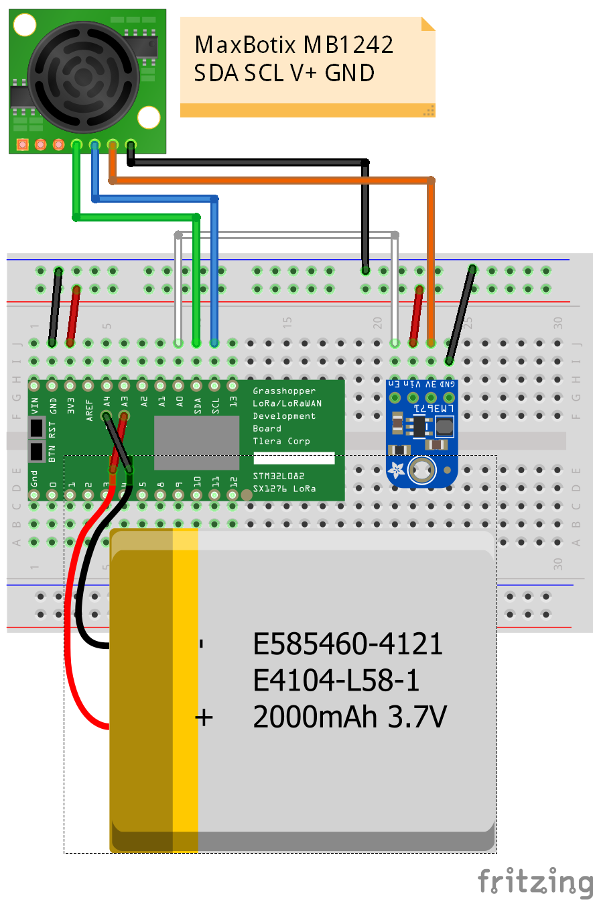
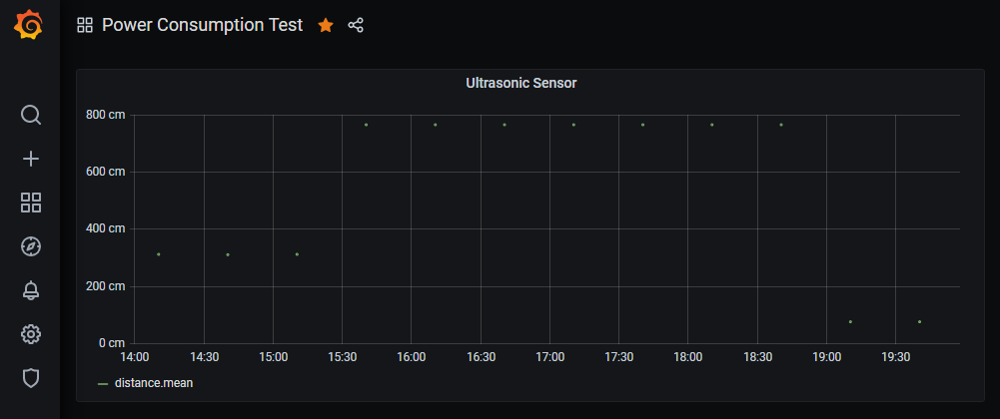
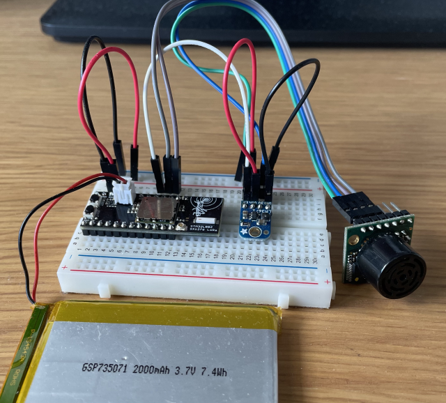

# Grasshopper LoRaWAN Development Board and Ultrasonic Sensor

Simple LoRaWAN node connected to The Things Network (TTN) using a [Grasshopper LoRa/LoRaWAN Development Board](https://www.tindie.com/products/tleracorp/grasshopper-loralorawan-development-board/). As sensor a [MB1242 I2CXL-MaxSonar-EZ4](https://www.maxbotix.com/ultrasonic_sensors/mb1242.htm) is used, that is connected via I2C. It returns the distance in centimeter as an array of 2 bytes.

The most prominent goal was to find out how to design a device and its software in order to minimize the energy consumption in order to maximize battery life.

## Motivation

* In many cases, LoRaWAN nodes are deployed in remote places without a static power supply. So both hardware and software need to be designed in a way that allows battery operation.
* With battery operation, operation of at least 1 year should be technically feasible these days, given that sending sensor values only a few times per day is good enough for the given use case.
* The board contains a ultra-low-power [STM32L082](https://www.st.com/en/microcontrollers-microprocessors/stm32l082cz.html) MCU, in stop mode the Grasshopper uses just 2.1 µA. Let's see how long we can get along with that.

## Wiring

I did the wiring on a half-sized breadboard.

The MaxBotix MB1242 consumes a consiberable amount energy, even in idle mode, so an (Adafruit LM3671 3.3V Buck Converter Breakout)[https://www.adafruit.com/product/2745] is used as kind of “switch” to cut-off the power supply for this sensor when it is not in use. Yes, people say that cutting off the power supply is **not sufficient** to make sure that the MB1242 really no longer consumes any energy, but in my case this trick was very effective.

## Additinal modifications

* Disabled the power-on led on the Grasshopper board by cutting the trace between the solder pads on the back.
* Sondered a JST-PH socket on the board in order to connect it with a LiPo battery.

## Source code

Thanks to good support of the Arduino platform, including many samples, it was easy to start with the Grasshopper board, given that already has some experience.

There are libraries that already provide LoRaWAN functionality and communication over the I2C bus.

So the functionality could be implemented with just a few lines of code.

    #include <STM32L0.h>
    #include "Wire.h"
    #include "LoRaWAN.h"
    
    const char *appEui = "70B3xxxxxxxxxxxx";
    const char *appKey = "xxxxxxxxxxxxxxxxxxxxxxxxxxxxxxxx";
    const char *devEui = "xxxxxxxxxxxxxxxx"; 
    
    void setup()
    {
      // Pin A0 controls the EN pin of the LM3671
      // LM3671 acts as kind of power supply that can be switched on or off.
      pinMode(A0, OUTPUT);
      
      Wire.begin();
    
      LoRaWAN.begin(EU868);
      LoRaWAN.setSubBand(2); // for TTN 
      LoRaWAN.joinOTAA(appEui, appKey, devEui);
    }
    
    void loop()
    {
        int size;
        uint8_t data[2];
    
        // Pull "enable" of LM3671 to high in order to provide supply power
        // to the MB1242 sensor.
        digitalWrite(A0, HIGH);
    
        // Give the sensor some time to start up.
        delay(200);
    
        Wire.beginTransmission(224 >> 1);
        Wire.write(81);
        Wire.endTransmission();
    
        delay(200);  // Give the sensor some time to do a range reading
    
        size = Wire.requestFrom(224 >> 1, 2);
    
        if (size)
        {
            Wire.read(data, size);
    
            if (!LoRaWAN.busy() && LoRaWAN.joined()) {
            LoRaWAN.beginPacket();
            LoRaWAN.write(data[0]);
            LoRaWAN.write(data[1]);
            LoRaWAN.endPacket();
            }
        }
    
        // Pull "enable" of LM3671 to low in order to cut-off power
        // from the MB1242 sensor.
        digitalWrite(A0, LOW);
    
        // Sleep 30 minutes
        STM32L0.stop(30 * 60 * 1000);
    }

## What else ?

To collect and visualize the distance measurements, the following technology stack can be used:

* [Node-RED](https://nodered.org/) - Connect to The Things Network and receive the distance measurements, store them to InfluxDB
* [InfluxDB](https://www.influxdata.com/) - Store the distance measurements in a time series database
* [Grafana](https://grafana.com/) - Create nice diagrams from time series data

